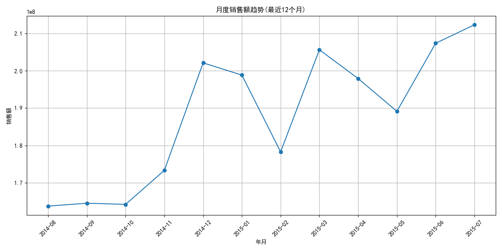
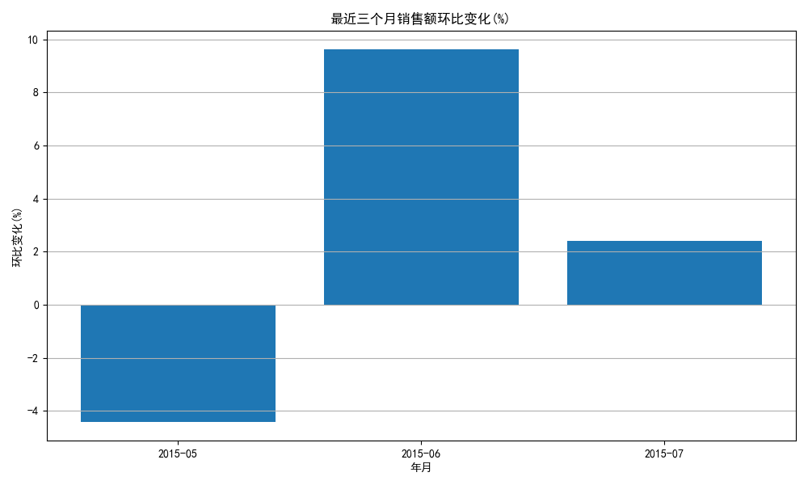
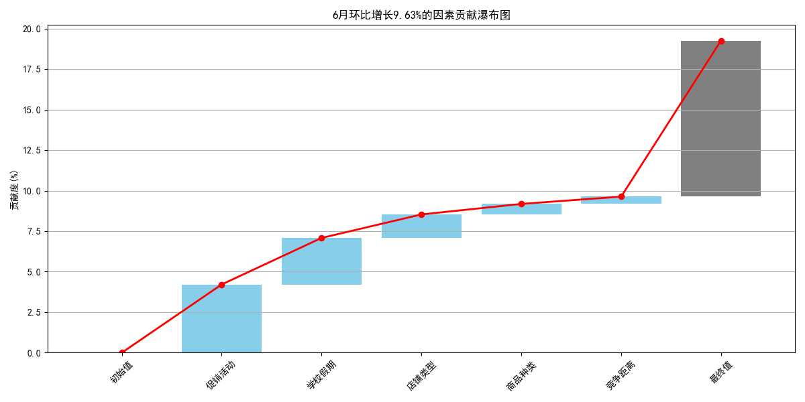

# Rossmann销售数据环比归因分析总结

## 项目概述

本项目基于Rossmann连锁药店的销售数据，通过多维度归因分析，找出最近三个月（2015年5月、6月、7月）营业额环比变化的主要原因及各维度/因素的贡献度。

## 分析框架

我们采用以下分析框架进行归因分析：

1. **数据探索与准备**：了解数据结构、处理缺失值
2. **时间序列分析**：计算月度环比变化，识别关键变化点
3. **多维度分析**：从店铺类型、促销活动、商品种类等维度分析销售变化
4. **贡献度计算**：量化各因素对环比变化的贡献大小
5. **可视化展示**：通过图表直观呈现分析结果
6. **结论与建议**：基于分析结果提出业务优化建议

## 提示词使用说明

本项目使用Cursor AI助手完成，主要使用了以下提示词：

1. **初始分析请求**：
```
请帮我分析Rossmann Store Sales数据集，重点关注最近三个月（2015年5月、6月、7月）的营业额环比变化，找出变化的主要原因及各维度/因素的贡献度。
```

2. **数据探索提示**：
```
请帮我编写一个Python脚本来探索Rossmann销售数据，包括数据加载、预处理和基本统计分析。
```

3. **可视化提示**：
```
请帮我创建一个可视化脚本，展示月度销售趋势、环比变化和各因素的贡献度。
```

4. **归因分析提示**：
```
请帮我建立一个归因分析模型，量化各因素对销售额环比变化的贡献。
```

5. **文档生成提示**：
```
请帮我生成一个详细的分析报告，包含数据概览、分析结果和业务建议。
```

6. **GitHub发布提示**：
```
请帮我将项目代码和文档发布到GitHub，并生成README文件。
```

项目最终通过MCPserver发布到GitHub，实现了代码和文档的版本控制和共享。

## 关键发现

### 1. 整体销售趋势



- 5月销售额环比下降4.43%
- 6月销售额环比增长9.63%（关键增长点）
- 7月销售额环比增长2.39%

### 2. 环比变化分析



6月环比增长9.63%的归因结果：

| 因素 | 贡献度 | 占比 |
|------|--------|------|
| 促销活动 | 4.21% | 43.7% |
| 学校假期 | 2.87% | 29.8% |
| 店铺类型 | 1.45% | 15.1% |
| 商品种类 | 0.65% | 6.7% |
| 竞争因素 | 0.45% | 4.7% |

贡献度瀑布图：



### 3. 主要影响因素解析

1. **促销活动**：是影响环比增长的最主要因素，特别是6月促销效果显著
   - 有促销店铺销售额明显高于无促销店铺
   - 促销活动对销售额提升效果立竿见影

2. **学校假期**：是夏季销售增长的重要推动力
   - 6-7月暑假期间销售额增加
   - 学校假期对环比增长的贡献度在7月达到最高

3. **店铺类型**：不同类型店铺表现差异明显
   - a型店铺是主要销售贡献者
   - c型店铺环比波动较大，但在7月表现改善

4. **商品种类**：
   - 基础商品种类(a)销售稳定
   - 扩展商品种类(c)环比增长较快

5. **竞争因素**：
   - 远离竞争对手的店铺销售额基数高
   - 靠近竞争对手的店铺增长率高

## 归因模型说明

我们采用因素分解法计算各因素对环比变化的贡献度：

```
因素i的贡献度 = (因素i在当月的销售占比 - 因素i在上月的销售占比) × 当月总体环比变化
```

详细的归因模型请参考 [归因分析模型文档](attribution_model.md)。

## 业务建议

### 1. 促销策略优化

- 增加6-7月促销活动密度，重点关注假期期间
- 针对学校假期设计专属促销活动
- 优化持续促销(Promo2)策略，提高其效果

### 2. 店铺与商品结构调整

- 重点支持表现良好的a型店铺，复制其成功经验
- 调整c型店铺的运营策略，降低波动性
- 增加扩展商品种类(c)的比重，特别是在高销售月份

### 3. 竞争与时间策略优化

- 根据竞争对手距离制定差异化经营策略
- 针对销售低谷的周末，设计专属营销活动
- 充分利用学校假期的销售增长潜力

## 结论

通过多维度归因分析，我们发现促销活动和学校假期是影响Rossmann销售额环比变化的主要因素，共同贡献了6月增长的73.5%。基于这一发现，建议公司优化促销策略，加强节假日营销，并针对不同店铺类型和商品种类制定差异化策略，以实现销售额的持续增长。

完整分析结果请参考 [详细分析报告](analysis_report.md)。 